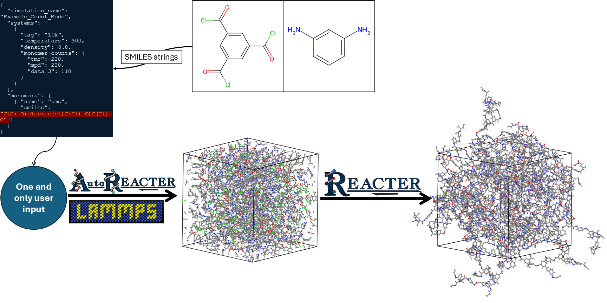

.. AutoREACTER documentation master file, created by
   sphinx-quickstart on Tue Apr 14 10:57:05 2026.
   You can adapt this file completely to your liking, but it should at least
   contain the root `toctree` directive.

AutoREACTER documentation
=========================

Welcome to AutoREACTER.

AutoREACTER is an open-source Python toolkit for preparing REACTER-ready
LAMMPS input files from molecular structures. It automates the generation of
reaction templates, atom mappings, molecular systems, and LAMMPS input scripts
for classical reactive molecular dynamics workflows.

AutoREACTER is developed as part of the Multiscale Polymer Toolkit (MuPT).
It bridges the gap between raw chemical structures and REACTER-ready LAMMPS
input files for atomistic simulations.

**Note:** AutoREACTER is currently in v0.2-beta.0 and under active development.
APIs, configuration schemas, and core functionality may change as we continue
to expand the reaction library and force field support.

GitHub repository: https://github.com/NanoCIPHER-Lab/AutoREACTER

.. toctree::
   :maxdepth: 1
   :caption: User Guide:

   overview.md
   getting-started.md
   input-configuration.md
   supported-reactions.md
   supported-force-fields.md
   clean_up.md
   change_log.md
   contact.md

.. toctree::
   :maxdepth: 2
   :caption: Developer API:

   modules